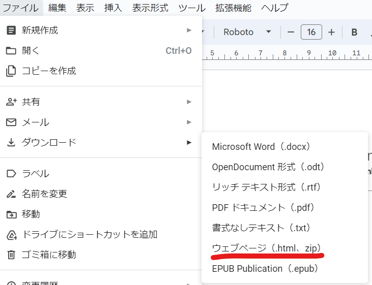

============================================================================
Google DocsをConfluenceのページに移行する方法
============================================================================

このガイドでは、Google DocsのドキュメントをConfluenceに移行する手順を説明します。

手順
======================================

1. Google DocsからHTMLをダウンロードする
--------------------------------------------------

Google Docsの「ファイル」メニューから「ダウンロード」→「Webページ（.html、zip圧縮）」を選択します。

2. Googleからダウンロードした画像すべてをページにアップロードする
----------------------------------------------------------------------------------------------------

ダウンロードしたZIPファイルに含まれる画像を、Confluenceページにアップロードします。

.. code-block:: bash

   $ confluence attachment create --page_id ${pageId} --dir images

拡張子がない画像をアップロードする場合は、 ``--mime_type`` で画像用のMIMEタイプを指定してください。
そうしないと、Confluence用XMLでファイルを参照することができません。
詳細は https://qiita.com/yuji38kwmt/items/ea09b70a06ac99f9c865 を参照してください。

.. code-block:: bash

   $ confluence attachment create --page_id ${pageId} --dir images --mime_type "image/png"

3. HTMLファイルをConfluence用のXMLに変換する
--------------------------------------------------

``confluence local convert_html`` コマンドを使用して、HTMLファイルをConfluence用のXMLに変換します。

.. code-block:: bash

   $ confluence local convert_html ${HTML_FILE} ${XML_FILE}

4. Confluenceのページを編集モードにして、"Source Editor"を開く
----------------------------------------------------------------------------------------------------

Confluenceのページを編集モードにして、メニューから「Source Editor」を開きます。

変換した ``${XML_FILE}`` の中身をSource Editorに貼り付けて、「Apply」ボタンを押します。

なお、以下のコマンドでもページを更新できます。

.. code-block:: bash

   $ confluence page update --page_id ${PAGE_ID} --xml_file ${XML_FILE}

備考
======================================

* Confluenceに移行したページでは、内部リンクは無効になります。

